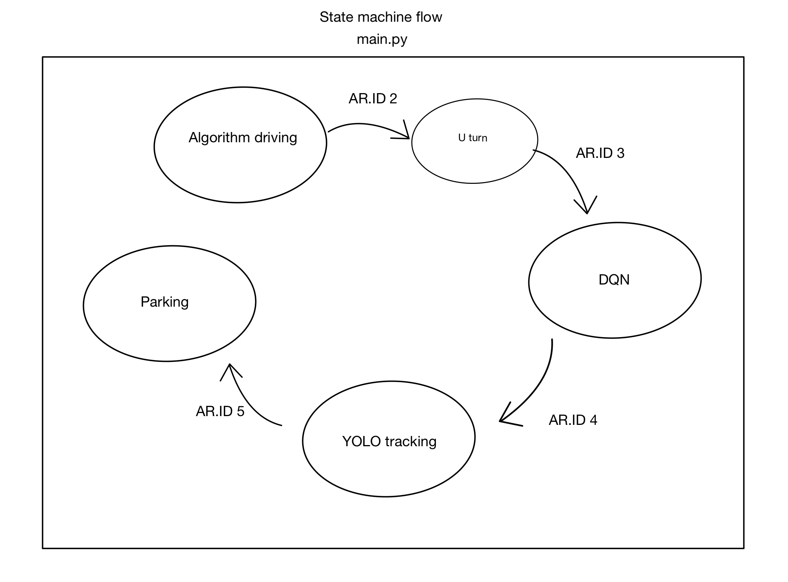

# Grepp - Xytron Auto-pilot Competition 3

## Final video

## Goal
* Auto-pilot driving and parking using lidar sensor.
1. Make algorithm using only lidar sensor that drive safely without crushing to the box.
2. Given random Ar-Marker which represents a specific object, track it using YOLO.
3. Park using Ar-Marker pose.

## Procedure

### STATE MACHINE FLOW

* Made each feature as a class and used it as a module

### Algorithm driving
* Divided the track by its feature which was appropriate for specific action of a car.
* There are four actions. 
1. Go straight while stick to the right.
2. Go straight while stick to the left.
3. Rotate right.
4. Rotate left.
* Used P-control for action one and two.

### YOLO Tracking
* Used action one and two in algorithm driving.

### U-Turn
* Used lidar data to make simple u-turn algorithm.

### Parking (Wasn't my part.)
* Used time sleep to go backwards when position of a car wasn't accurate.
* Used Ar-markers pose to park.

### DQN
* Failed to implement.

## Limitations
* Due to the nature of a DQN, we had to train the model in the simulation which wasn't able to apply it to the car.
* We could have played with the simulation or even make one. But we had a lot of tasks to finish within limited time.

## What I've learned
* Make others' code to a class and import it in main source code.
* Got much familiar with making and using a class in Python.

